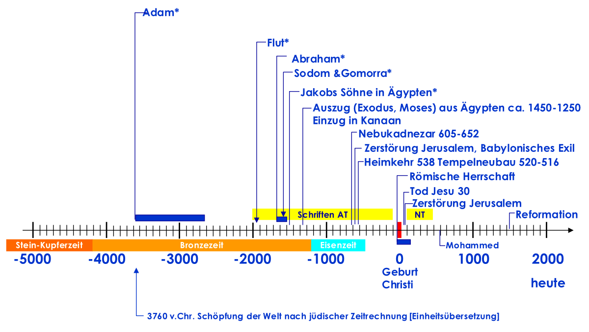
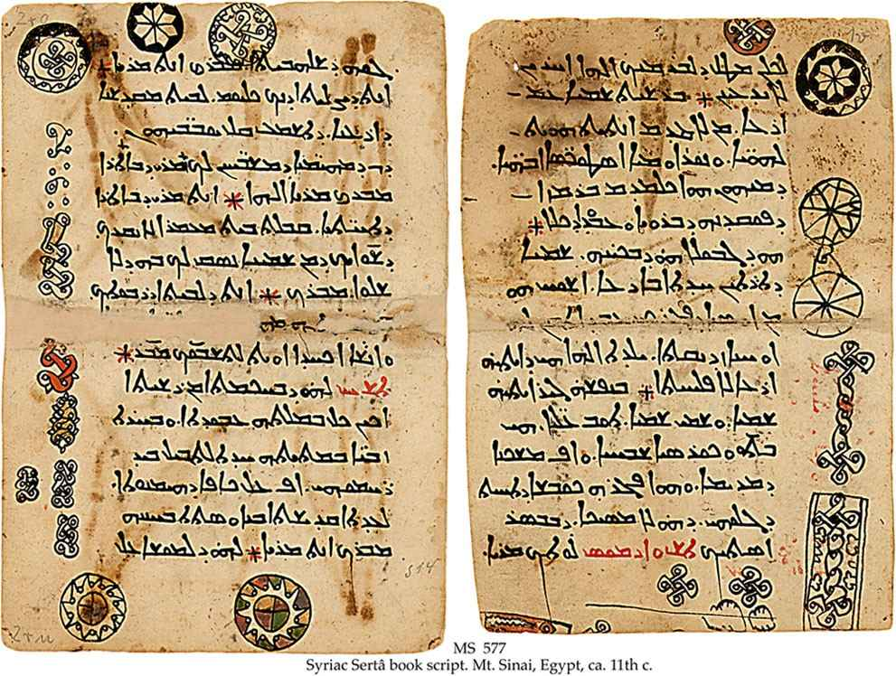
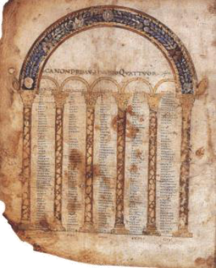

# Die Bibel
--
## Bibel Christians III. von Dänemark, 1550

---

## Begriffsbestimmung

* Bibel von griech. βιβλιον _Papyrusrolle_
* 1 Rolle = 1 _Buch_
* AT je nach Version Sammlung von 39 – 51 Büchern
* AT oder AT+NT als 1 Buch betrachtet → __Buch der Bücher__

--

### Tora Synagoge Köln

--

### Heracles Papyrus

--

### Papyrus

---

## Zur biblischen Datierung

> Gen 5,4: «Als Adam nun 130 Jahre alt war, zeugte er einen Sohn, ihm gleich und nach seinem Bilde, und nannte ihn Set.»

> Gen 5,5: «Insgesamt lebte Adam 930 Jahre, dann starb er.»

> Gen 5,6: «Im Alter von 105 Jahren zeugte Set den Enos...»

--

### Zur biblischen Datierung

|                | Zeugte | Todesalter |
|----------------|-------:|-----------:|
| **Adam**       |    130 |        930 |
| Set            |    105 |        912 |
| Enos           |     90 |        905 |
| Kenan          |     70 |        910 |
| Mahalalel      |     65 |        895 |
| Jared          |    162 |        962 |
| Henoch         |     65 |        365 |
| Metuschelach   |    187 |        969 |
| Lamech         |    182 |        777 |
| Noe            |    500 |        950 |
| **Zwischentotal Jahr nach Erschaffung Adams** | **1556** |            |
| **Sem, Cham, Japhet** |        |            |
| **Flut im 601. Jahr Noe** | **1657** |            |

--

### Zur biblischen Datierung

--

### Geschichtlicher Rahmen 

*[Bibel\* und Geschichtsbücher]*

---

## Sprachen

--

### Hebräisch

#### Psalm 1,1-2 nach dem Text der Biblia Hebraica

> אַ֥שְֽׁרֵי־הָאִ֗ישׁ אֲשֶׁ֤ר ׀ לֹ֥א הָלַךְ֮ בַּעֲצַ֢ת רְשָׁ֫עִ֥ים וּבְדֶ֣רֶךְ חַ֭טָּאִים לֹ֥א עָמָ֑ד וּבְמוֹשַׁ֥ב לֵ֝צִ֗ים לֹ֣א יָשָֽׁב׃
> כִּ֤י אִ֥ם בְּתוֹרַ֥ת יְהוָ֗ה חֶ֫פְצ֥וֹ וּֽבְתוֹרָת֥וֹ יֶהְגֶּ֗ה יוֹמָ֥ם וָלָֽיְלָה׃

--

### Hebräisch

- Sprache des alten Kanaan (bezogen ca. 1250 v.Chr.)
- abgeleitet aus aramäischer Schrift des persischen Weltreiches 5.-4.Jh. v.Chr.
- Beinahe ganzes AT
- Erhaltene Handschriften 200 v.Chr. bis 68 n.Chr.

--

### Aramäisch

- Seit 8. Jh. v.Chr.
- Sprache des persischen Weltreiches 5.-4.Jh. v.Chr.
- Einige Teile des AT (Gn, Jer, Esd)
- NT: Matthäus Evangelium (??)
- Muttersprache Jesu und seiner Jünger = Galiläischer Dialekt des Aramäischen

--

### Aramäisch - 800 - 400 v.Chr.

*Zauberschale, Jüdisches Museums der Schweiz, 800 - 400 v.Chr.*

--

### Aramäisch - 11.Jh.

--

### Griechisch

- 300 v.-500 n.Chr. 
- Gemeinsame Sprache im östl. Mittelmeerraum
- AT: Wsh und 2 Mkk
- NT
- Erhaltene Handschriften 200 v.Chr. bis 68 n.Chr.

--

### Griechisch - Ausschnitt aus der Septuaginta

---

## Entstehung der Bibel

--

### Entstehung des Alten Testaments

- Mündliche Weitergabe bis etwa 2000 v.Chr.
- Erste Aufzeichnungen (Genesis) in Keilschrift evtl. auf Tontafeln, sehr kompakte Sätze
- Papyrus und alphabetisch Schrift liessen umfangreichere und nuancenreichere Schriften zu, vermutlich durch Moses (ca. 1250 v.Chr.) verwendet
- Sprache vorwiegend Hebräisch (Sprache der Israeliten), Teile in Aramäisch (Diplomatensprache der antiken Welt)
- Nach Alexander dem Grossen (nach 330 v.Chr.) griechisch als universelle Sprache; → «Septuaginta» als Standardversion für alle Synagogen der Welt.

--

### Entstehung des Neuen Testaments

- Keine ersten Schriften erhalten
- Urtexte vermutlich griechisch, zuerst auf Papyrus, dann auf Pergament kopiert; griechisch auch den Römern geläufig
- (Latein im Mittelalter)
- Von der Schriftrolle zum Codex: 66 Bücher ermittelt (davon 39 AT), 27 NT)
  - Vulgata und Einheitsübersetzung heute 45 Bücher des AT
- Im 2. Jh. Codex (Buch mit Seiten) in Gebrauch → «Die Bibel».
- Frühe «unzählige» Übersetzungen ins Lateinische → Texte in grosser Zahl, aber keiner unbestritten!
- 383 Auftrag Papst Damasus an den hl. Hieronymus zur Verbesserung der lateinischen Bibeltexte → Vulgata

--

### Die Vulgata des Hl. Hieronymus

*Hl. Hieronymus nach dem Bild von Albrecht Dürrer*

--

### Die Vulgata des Hl. Hieronymus

- 4.J. n.Chr., Dalmatien (Kroatien), Kirchenvater; tätig auch in Rom, Palästina
- Übersetzte grosse Teile AT und NT ins Latein
- Sehr sorgfältige Recherchen; Original der Hexapla des Origenes
- Meister der lateinischen Prosa
- Seine Version erst ab 8.Jh. allgemein verbreitet → «Vulgata»
- Später Textzerfall durch Abschreiben → Buchdruck, Reformation
- Konzil von Trient 1546: Wunsch nach fehlerfreier Fassung, Imprimatur
- Pius X 1907 Auftrag an Benediktiner zur Wiederherstellung der Vulgata

---
## Wer erkennt die Bibel an?

--
### Juden

- Nur Tanach (hebr. תַּנַ״ךְ: Torah, Nevi’im, Ketuvim; 24 Bücher). 
- Kein NT
- keine deuterokanonischen Bücher

--
### Röm. Katholiken

- Altes Testament (46 Bücher, inkl. 7 deuterokanonische + Ergänzungen) 
- Neues Testament (27 Bücher).

--

### Orthodoxe

- Altes Testament (49–51 Bücher, erweiterte deuterokanonische)
- Neues Testament (27 Bücher).

--

### Evangelische / Reformierte
- Altes Testament (39 Bücher, nur protokanonisch)
- Neues Testament (27 Bücher)

--

### Muslime
- Bibel als frühere Offenbarung (Tawrat – توراة, Zabur – زبور, Injil – إنجيل) anerkannt, aber verfälscht (tahrīf – تحريف)
- Koran ersetzt sie

---
## Hexapla Bibel

Bibel des Alten Testaments von Origenes 182-234

--
### Hexapla

- **Hexapla** (griech. Ἑξαπλᾶ – Hexaplâ, „sechs-fach“): Kritische Edition des AT von Origenes (griech. Ὠριγένης, ca. 184–253) um 230–240 in Cäsarea.
- **Zweck:** Textkritik der LXX gegenüber hebräischem Original (griech. θεόπνευστος – theópneustos, „von Gott eingehaucht“).
- **Bedeutung:** Sichert Einheit der inspirierten Schrift; beeinflusste Übersetzungen; Original verloren (7. Jh.).

--
### Aufbau der Hexapla

* In sechs parallelen Spalten:
  1. Hebräischer Text in hebräischen Buchstaben.
  2. Hebräischer Text in griechischer Transliteration.
  3. Übersetzung des Aquila von Sinope (um 130 n. Chr., wörtlich und jüdisch orientiert).
  4. Übersetzung des Symmachus (um 200 n. Chr., idiomatisch und elegant).
  5. Septuaginta (LXX, die 70er Übersetzung, mit kritischer Bearbeitung durch Origenes: Asterisken \* für hebräische Ergänzungen und Obelisken ÷ für Überschüssiges).
  6. Übersetzung des Theodotion (um 180 n. Chr., nah am hebräischen Text).