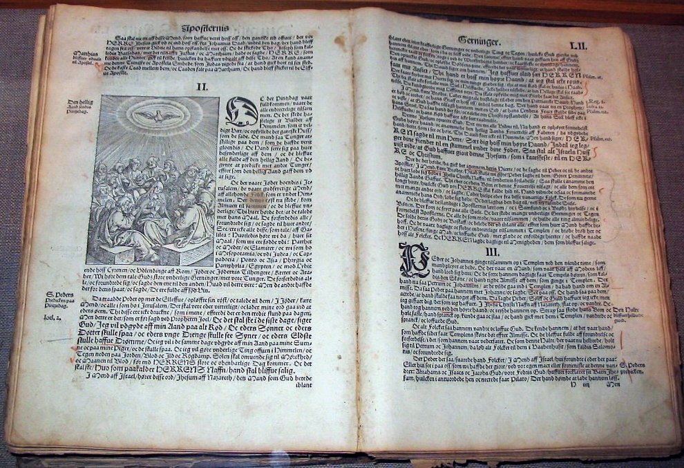
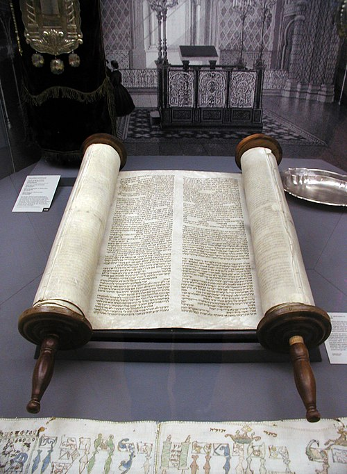
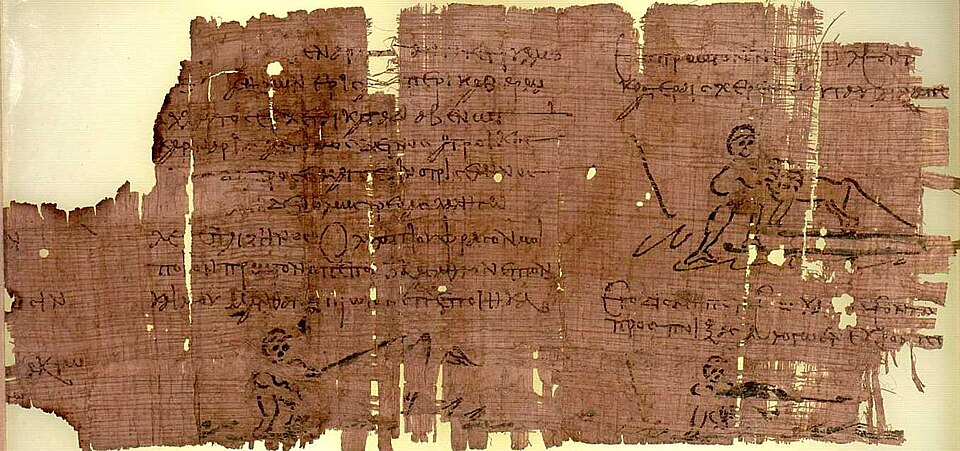
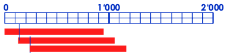
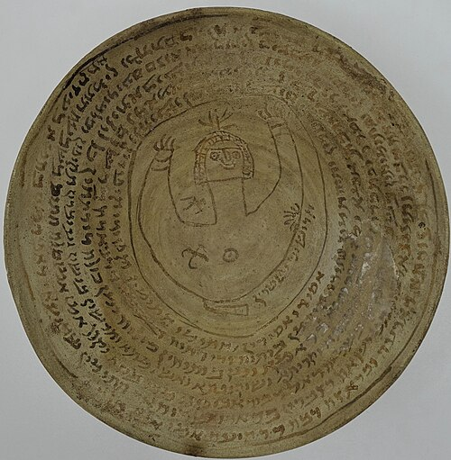
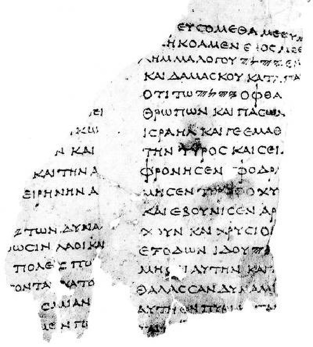

# Die Bibel
--
## Bibel Christians III. von Dänemark, 1550

---

## Begriffsbestimmung

* Bibel von griech. βιβλιον _Papyrusrolle_
* 1 Rolle = 1 _Buch_
* AT je nach Version Sammlung von 39 – 51 Büchern
* AT oder AT+NT als 1 Buch betrachtet → __Buch der Bücher__

--

### Tora Synagoge Köln

--

### Heracles Papyrus

--

### Papyrus

---

## Zur biblischen Datierung

> Gen 5,4: «Als Adam nun 130 Jahre alt war, zeugte er einen Sohn, ihm gleich und nach seinem Bilde, und nannte ihn Set.»

> Gen 5,5: «Insgesamt lebte Adam 930 Jahre, dann starb er.»

> Gen 5,6: «Im Alter von 105 Jahren zeugte Set den Enos...»

--

### Zur biblischen Datierung

|                | Zeugte | Todesalter |
|----------------|-------:|-----------:|
| **Adam**       |    130 |        930 |
| Set            |    105 |        912 |
| Enos           |     90 |        905 |
| Kenan          |     70 |        910 |
| Mahalalel      |     65 |        895 |
| Jared          |    162 |        962 |
| Henoch         |     65 |        365 |
| Metuschelach   |    187 |        969 |
| Lamech         |    182 |        777 |
| Noe            |    500 |        950 |
| **Zwischentotal Jahr nach Erschaffung Adams** | **1556** |            |
| **Sem, Cham, Japhet** |        |            |
| **Flut im 601. Jahr Noe** | **1657** |            |

--

### Geschichtlicher Rahmen 

[Bibel* und Geschichtsbücher]

---

## Sprachen

--

### Hebräisch

#### Psalm 1,1-2 nach dem Text der Biblia Hebraica

> אַ֥שְֽׁרֵי־הָאִ֗ישׁ אֲשֶׁ֤ר ׀ לֹ֥א הָלַךְ֮ בַּעֲצַ֢ת רְשָׁ֫עִ֥ים וּבְדֶ֣רֶךְ חַ֭טָּאִים לֹ֥א עָמָ֑ד וּבְמוֹשַׁ֥ב לֵ֝צִ֗ים לֹ֣א יָשָֽׁב׃
> כִּ֤י אִ֥ם בְּתוֹרַ֥ת יְהוָ֗ה חֶ֫פְצ֥וֹ וּֽבְתוֹרָת֥וֹ יֶהְגֶּ֗ה יוֹמָ֥ם וָלָֽיְלָה׃

- Sprache des alten Kanaan (bezogen ca. 1250 v.Chr.)
- abgeleitet aus aramäischer Schrift des persischen Weltreiches 5.-4.Jh. v.Chr.
- Beinahe ganzes AT
- Erhaltene Handschriften 200 v.Chr. bis 68 n.Chr.

--

### Aramäisch

- Seit 8. Jh. v.Chr.
- Sprache des persischen Weltreiches 5.-4.Jh. v.Chr.
- Einige Teile des AT (Gn, Jer, Esd)
- NT: Matthäus Evangelium (??)
- Muttersprache Jesu und seiner Jünger = Galiläischer Dialekt des Aramäischen

--

### Aramäisch - 800 - 400 v.Chr.

Zauberschale, Jüdisches Museums der Schweiz, 800 - 400 v.Chr.

--

### Aramäisch - 11.Jh.

--

### Griechisch

- 300 v.-500 n.Chr. 
- Gemeinsame Sprache im östl. Mittelmeerraum
- AT: Wsh und 2 Mkk
- NT
- Erhaltene Handschriften 200 v.Chr. bis 68 n.Chr.

--

### Griechisch - Ausschnitt aus der Septuaginta

---

## Entstehung der Bibel

--

### Entstehung des AT

- Mündliche Weitergabe bis etwa 2000 v.Chr.
- Erste Aufzeichnungen (Genesis) in Keilschrift evtl. auf Tontafeln, sehr kompakte Sätze
- Papyrus und alphabetisch Schrift liessen umfangreichere und nuancenreichere Schriften zu, vermutlich durch Moses (ca. 1250 v.Chr.) verwendet
- Sprache vorwiegend Hebräisch (Sprache der Israeliten), Teile in Aramäisch (Diplomatensprache der antiken Welt)
- Nach Alexander dem Grossen (nach 330 v.Chr.) griechisch als universelle Sprache; → «Septuaginta» als Standardversion für alle Synagogen der Welt.

--

### Entstehung des NT

- Keine ersten Schriften erhalten
- Urtexte vermutlich griechisch, zuerst auf Papyrus, dann auf Pergament kopiert; griechisch auch den Römern geläufig
- (Latein im Mittelalter)
- Von der Schriftrolle zum Codex: 66 Bücher ermittelt (davon 39 AT), 27 NT)
  - Vulgata und Einheitsübersetzung heute 45 Bücher des AT
- Im 2. Jh. Codex (Buch mit Seiten) in Gebrauch → «Die Bibel».
- Frühe «unzählige» Übersetzungen ins Lateinische → Texte in grosser Zahl, aber keiner unbestritten!
- 383 Auftrag Papst Damasus an den hl. Hieronymus zur Verbesserung der lateinischen Bibeltexte → Vulgata